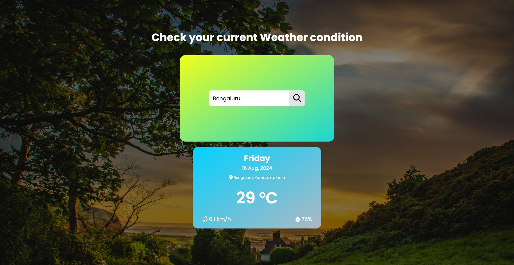

# Weather App

This Weather App provides real-time weather information for any location worldwide. It allows users to search for a city and instantly view the current weather, temperature, humidity, and other weather related details. The app is built using HTML, CSS, and JavaScript, leveraging the Fetch API to retrieve weather data.

## Screenshots


## Table of Contents
- [Installation](#installation)
- [Usage](#usage)
- [Features](#features)
- [Technologies Used](#technologies-used)
- [Contributing](#contributing)

## Installation
1. Clone the repository:
    ```
    git clone https://github.com/amehtacc/Weather-App
    ```
2. Navigate to the project directory:
    ```
    cd weather-app
    ```
3. Open the `index.html` file in your preferred browser.

## Usage
1. Open the application in your browser.
2. Enter the name of the city you want to check the weather for.
3. Click the "Search" icon.
4. The application will display the current weather, temperature, humidity, and other details for the specified city.

## Features
- Real-time weather information for any city.
- User-friendly interface with responsive design.
- Displays temperature, humidity, weather conditions, and wind speed.
- Fetches data using the Fetch API.

## Technologies Used
- Core Languages: HTML, CSS, JavaScript
- Web Technologies: Fetch API
- Version Control: Git

## Contributing
Contributions are welcome! Please fork this repository and submit a pull request for any features, improvements, or bug fixes.

## Contact Information
Build with ❤️ by [Aryan Mehta](https://www.linkedin.com/in/crispcoding/) - feel free to contact me!
